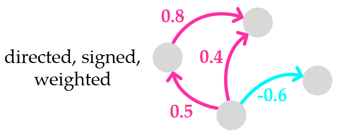

# Opinion Maximization in Social Trust Networks
Matlab implementation of methods proposed in "[Opinion Maximization in Social Trust Networks](http://arxiv.org/abs/2006.10961)", Pinghua Xu, Wenbin Hu, Jia Wu and Weiwei Liu, IJCAI 2020.

## Overview
- `input/` contains four example graphs `Bitcoin-Alpha` `Bitcoin` `WikiElec` `WikiRfa`;
- `SIOP.mlx` is the implementation of SIOP method proposed in the paper;
- `SEOP.mlx` is the implementation of SEOP method;
- `initOP.m` is a Matlab function for initializing internal opinion, and it is called by `SIOP.mlx` and `SEOP.mlx`.

## Requirements
The implementation is tested under Matlab R2019b. The other version of Matlab, which supports live script, is also optional.

## Input
We investigated **social trust network**, which can be represented by a **directed signed (un)weighted** graph, in this work.

And a toy example is illustarted in the figure.
<div style="text-align:center"></div>

The code takes an input graph in `.txt` format. Every row indicates an edge between two nodes separated by a `space` or `\t`. The file does not contain a header. Nodes can be indexed starting with any positive number (**excluding 0**). Four example graphs (donwloaded from [SNAP](http://snap.stanford.edu/data/#signnets), but node ID is resorted) `Bitcoin-Alpha` `Bitcoin` `WikiElec` `WikiRfa` are included in the `input/` directory. The structure of the input file is the following:

| Source node | Target node | Weight |
| :-----:| :----: | :----: |
| 0 | 1 | -1 |
| 1 | 3 | 3 |
| 1 | 2 | 4 |
| 2 | 4 | -6 |

## Instruction
Copy this project to your Matlab. Run `SIOP.mlx` to test SIOP method, or run `SEOP.mlx` to test SEOP method.

In the parameter section of the live scripts, you can change `mode` to determine how to initialize internal opinions. And there are four options:

- `mode='uniform'` The internal opinions follow a uniform distribution;
- `mode='normal'` The internal opinions follow a standard normal distribution;
- `mode=pow` The absolute values of the internal opinions follow a power-law distribution, and each entry is negated with aprobability of 0.5.
- `mode=degree` The internal opinion of a node positively correlates to that node’s column connectivity, and each entry is negated with aprobability of 0.5.

And you can change `budget`, which is the budget of intervening, to any positve real number for SIOP and to any positve **integer** for SEOP.

## Cite
If you find this repository useful in your research, please cite our paper:
```
@misc{2006.10961,
  Author = {Pinghua Xu and Wenbin Hu and Jia Wu and Weiwei Liu},
  Title = {Opinion Maximization in Social Trust Networks},
  Year = {2020},
  Eprint = {arXiv:2006.10961},
}
```

Moreover, if you are interested in the topic of **social trust network**, you may want to know our another work "[Social Trust Network Embedding](https://ieeexplore.ieee.org/document/8970926)" (ICDM 2019).
